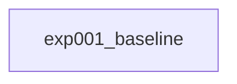

# 実験サマリー

## 実験系譜図

## 実験一覧

| 実験 | 概要 | CV Score | Public LB | Private LB | 主な知見 |
|------|------|----------|-----------|------------|----------|
| exp001_baseline | ベースライン | - | - | - | - |

## Key Findings

### データに関する知見

<!-- EDA・実験から得られたデータの性質 -->

### モデルに関する知見

<!-- モデル選択・ハイパーパラメータに関する発見 -->

### 前処理・後処理に関する知見

<!-- 効いた前処理・後処理 -->

## 有効なテクニック

<!-- 効果が確認されたアプローチ -->

## 避けるべきアプローチ

<!-- 効果がなかった・悪影響だったアプローチ -->

## Changelog

| 日付 | 内容 |
|------|------|
| 2026-03-03 | プロジェクト初期化、exp001_baseline 作成 |
